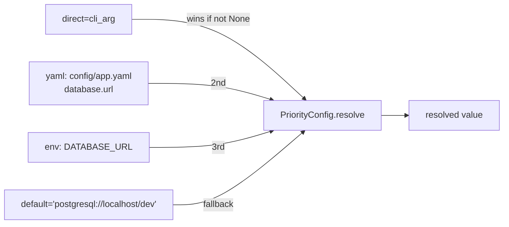

# scitex-config

<p align="center">
  <a href="https://scitex.ai">
    
  </a>
</p>

<p align="center"><b>Configuration + path management with `direct → yaml → env → default` priority cascade.</b></p>

<p align="center">
  <a href="https://scitex-config.readthedocs.io/">Full Documentation</a> · <code>uv pip install scitex-config[all]</code>
</p>

<!-- scitex-badges:start -->
<p align="center">
  <a href="https://pypi.org/project/scitex-config/"></a>
  <a href="https://pypi.org/project/scitex-config/"></a>
  <a href="https://scitex-config.readthedocs.io/en/latest/"></a>
</p>
<p align="center">
  <a href="https://github.com/ywatanabe1989/scitex-config/actions/workflows/test.yml"></a>
  <a href="https://github.com/ywatanabe1989/scitex-config/actions/workflows/import-smoke-on-ubuntu-py3-12.yml"></a>
  <a href="https://github.com/ywatanabe1989/scitex-config/actions/workflows/scitex-dev-quality-audit-on-ubuntu-latest.yml"></a>
  <a href="https://codecov.io/gh/ywatanabe1989/scitex-config"></a>
</p>
<!-- scitex-badges:end -->

---

## Problem and Solution

| # | Problem | Solution |
|---|---------|----------|
| 1 | **Config values come from many sources** (CLI flags, YAML files, env vars, hard-coded defaults) and ad-hoc precedence rules drift between scripts. | **`PriorityConfig.resolve()`** enforces a single `direct → yaml → env → default` cascade with a resolution log. |
| 2 | **Runtime directories** (cache, logs, sessions) get hardcoded to `~/.cache/<pkg>/` and ignore the user's `$SCITEX_DIR`. | **`get_paths()` / `ScitexPaths`** roots directories at `$SCITEX_DIR`; **`_ecosystem.local_state.runtime_path()`** resolves per-package `<pkg>/runtime/` paths canonically. |
| 3 | **`.env` loading** is reinvented per project (cwd-only, no walk-up, silent override of process env). | **`load_dotenv(walk_up=True)`** walks parents to `$HOME`, never overrides existing process env, and returns a boolean status. |

## Installation

```bash
pip install scitex-config
```

## Architecture

```
scitex-config/
├── src/scitex_config/
│   ├── __init__.py              # get_config, get_paths, PriorityConfig
│   ├── _ScitexConfig.py         # YAML loader + dotted-path resolve()
│   ├── _PriorityConfig.py       # PriorityConfig: direct > yaml > env > default
│   ├── _paths.py                # ScitexPaths: flat $SCITEX_DIR path manager
│   ├── _ecosystem/              # SciTeX-internal helpers
│   │   ├── _local_state.py      # Per-package <pkg>/runtime/ path resolver
│   │   └── _env_registry.py     # SCITEX_* env var catalog
│   └── default.yaml             # Built-in defaults
└── tests/
```

## Quick Start

```python
import scitex_config as cfg

config = cfg.get_config()
log_level = config.resolve("logging.level", default="INFO")

paths = cfg.get_paths()
print(paths.cache)            # ~/.scitex/cache

# SciTeX-ecosystem packages: use the per-package state resolver
from scitex_config._ecosystem import local_state
log_path = local_state.runtime_path("hpc", "dispatch.log")
print(log_path)               # ~/.scitex/hpc/runtime/dispatch.log
```

## 1 Interfaces

<details open>
<summary><strong>Python API</strong></summary>

<br>

```python
import scitex_config as cfg

# YAML-based (recommended)
config = cfg.get_config()
print(config.MY_KEY)
log_level = config.resolve("logging.level", default="INFO")

# Path resolution
paths = cfg.get_paths()
paths.function_cache       # ~/.scitex/cache/function/...

# Layered priority cascade (direct > yaml > env > default)
pc = cfg.PriorityConfig(yaml_path="config/app.yaml")
db_url = pc.resolve(
    direct=cli_arg,
    key="database.url",
    env_var="DATABASE_URL",
    default="postgresql://localhost/dev",
)
```

</details>

## Demo


```mermaid
flowchart LR
    D[direct=cli_arg] -->|wins if not None| R[PriorityConfig.resolve]
    Y["yaml: config/app.yaml<br/>database.url"] -->|2nd| R
    E["env: DATABASE_URL"] -->|3rd| R
    F["default='postgresql://localhost/dev'"] -->|fallback| R
    R --> V["resolved value"]
```

## Status

Standalone fork of `scitex.config`. Only dep is `PyYAML`. The umbrella
package's `scitex.config` import path is preserved via a `sys.modules`-alias
bridge.

## Part of SciTeX

`scitex-config` is part of [**SciTeX**](https://scitex.ai). Install via
the umbrella with `pip install scitex[config]` to use as
`scitex.config` (Python) or `scitex config ...` (CLI).

>Four Freedoms for Research
>
>0. The freedom to **run** your research anywhere — your machine, your terms.
>1. The freedom to **study** how every step works — from raw data to final manuscript.
>2. The freedom to **redistribute** your workflows, not just your papers.
>3. The freedom to **modify** any module and share improvements with the community.
>
>AGPL-3.0 — because we believe research infrastructure deserves the same freedoms as the software it runs on.

## License

AGPL-3.0-only (see [LICENSE](./LICENSE)).

---

<p align="center">
  <a href="https://scitex.ai" target="_blank"></a>
</p>
